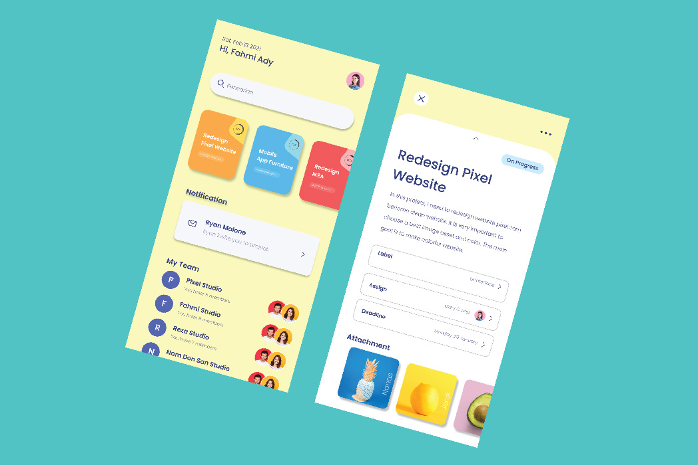
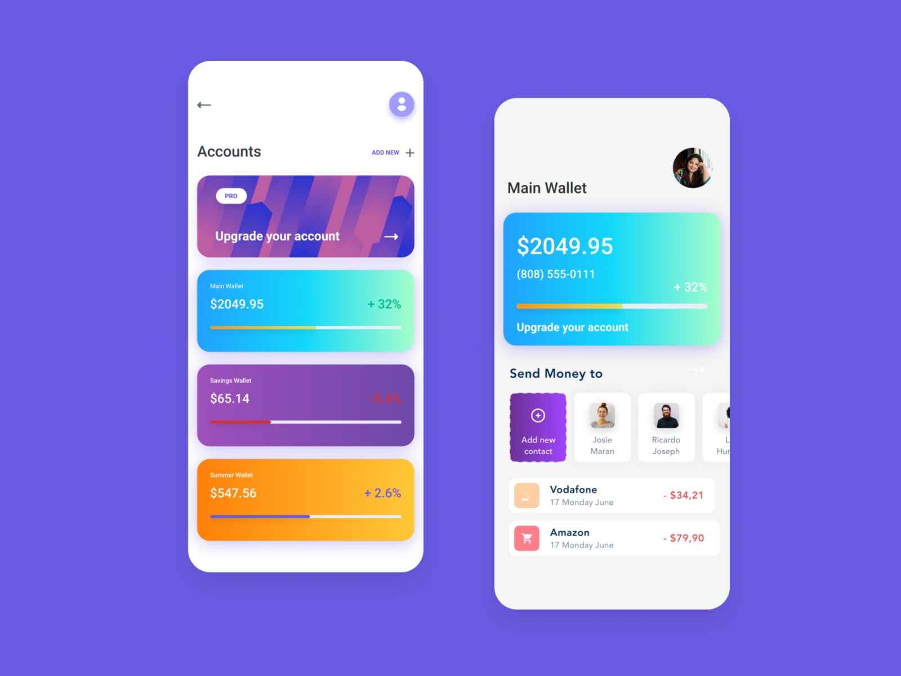

# LnTMidProject_FE-E_Kevin-Pangsawira
midproject BNCC

<!DOCTYPE html>
<html lang="en">
<head>
    <meta charset="UTF-8">
    <meta name="viewport" content="width=device-width, initial-scale=1.0">
    <title>Portofolio</title>
    <link rel="stylesheet" href="style.css">
</head>

<body>
    <header>
        <marquee behavior="action" scrollamount="10">
            <h1>Welcome to Portofolio <nama></h1>
        </marquee>
    </header>
    
Kevin Pangsawira

    

        <section class="about-me">
            
            

                
Deskripsi mengenai diri kamu

                <table>
                    <tr>
                        <th>Tahun</th>
                        <th>Deskripsi Pendidikan</th>
                    </tr>
                    <tr>
                        <td>2010</td>
                        <td>SD</td>
                    </tr>
                    <tr>
                        <td>2013</td>
                        <td>SMP</td>
                    </tr>
                    <tr>
                        <td>2016</td>
                        <td>SMA</td>
                    </tr>
                    <tr>
                        <td>2020</td>
                        <td>S1</td>
                    </tr>
                </table>
                
Berpengalaman sebagai UX Designer dan Creative User Interface Designer serta hardskill seperti editing dan menggambar

            

        </section>
        <section class="portfolio">
            

                <!--  -->
                
                  Experience  
                
                    
                

                    Senior Ux Designer (2014-2016)
                      
                    Company Name/ Location
                    
                      
                    Lorem ipsum is simply dummy text of the printing and 
                    typesetting 
                    industry. Lorem I has been the industry's standart
 
                

                

                

                    Creative User Interface Designer (2016-Present)

                      
                    Company Name/ Location
                      
                    Lorem ipsum is simply dummy text of the printing and 
                    typesetting 
                    industry. Lorem I has been the industry's standart
                      
                     
                       
                    
                        Pro Skills
                    
                    

                            

                            Photoshop
                                

                                    

                                    

                                

                            

                            

                                Illustrator
                                    

                                        

                                        

                                    

    
                                

                                

                                    Indesign
                                        

                                            

                                            

                                        

                
        
                                    
  

                                    

                                        After effect
                                            

                                                

                                                

                                            

            
                                        

                                        

                                            Sketch
                                                

                                                    

                                                    

                                                

                
                                            

                    

                   
               
                

               
             
                
            

           
        </section>
        <section class="contact">
            <h2>Contact</h2>
            <form action="">
                <input type="text" placeholder="Nama Lengkap">
                <input type="email" placeholder="Email">
                <input type="text" placeholder="LinkedIn">
                <textarea placeholder="Comment"></textarea>
                <button type="submit">Submit</button>
            </form>
        </section>
    

</body>
</html>

body {
    font-family: Arial, sans-serif;
    margin: 0;
    padding: 0;
}

header {
    background-color: black;
    color: #fff;
    padding: 20px;
    text-align: center;
    animation: Scale 5s infinite ease-in-out;
    
}

.container {
    max-width: 1200px;
    margin: auto;
    padding: 20px;
}

.about-me {
    /* display: flex; */
    justify-content: space-between;
    margin-top: 20px;
}

.about-me img {
    width: 200px;
    height: 250px;
    padding-left: 20px;
    /* border-radius: 50%; */
}

.about-me .description {
    flex: 1;
    margin-left: 20px;
}

.about-me table {
    width: 100%;
    border-collapse: collapse;
    margin-top: 20px;
}

.about-me table th, .about-me table td {
    border: 1px solid #ddd;
    padding: 8px;
    text-align: left;
}

.portfolio {
    font-size: 20px;
    margin-top: 20px;
    display: flex;
    flex-wrap: wrap;
    justify-content: space-between;
}

.portfolio .project {
    padding-left: 5%;
    flex-basis: calc(33.33% - 20px);
    margin-bottom: 20px;
}

.portfolio .project img {
    width: 100%;
    height: auto;
}

.contact {
    margin-top: 20px;
}

.contact form {
    display: flex;
    flex-direction: column;
    flex-wrap: wrap;
    justify-content: space-between;
}

.contact form input, .contact form textarea {
    width: calc(50% - 10px);
    padding: 10px;
    margin-bottom: 10px;
}

.contact form button {
    width: 20%;
    padding: 10px;
    background-color: #333;
    color: #fff;
    border: none;
    cursor: pointer;
}

img{
    animation: translate 1s ease-in-out;
}

@media screen and (max-width: 768px) {
    .contact form input, .contact form textarea {
        width: 100%;
    }
}

button:hover{
    animation: Scale2 infinite 1s ;
}
@keyframes Scale {
    0%,100% {
    }
    50% {
        background-color: white;
        color: black;
    }
}

@keyframes translate {
    0%,100% { 
        transform: translate(0px);
    }
    
    50% {
        transform: translate(180px);
        
       
    }
}

@keyframes Scale2 {
    0%,100% {
        transform: scale(1.2);
    }
    /* 50%{
        transform: scale(1.2);
    } */
}

#levelbox1 {
    width: 100px;
    height: 3px; 
    border: 1px solid #000; 
    position: relative;
    top: 4px;
    left: 35px;
    
    
  }

  #levelbox2 {
    width: 100px;
    height: 3px; 
    border: 1px solid #000; 
    position: relative;
    top: 4px;
    left: 45px;
    
    
  }
  #levelbox3 {
    width: 100px;
    height: 3px; 
    border: 1px solid #000; 
    position: relative;
    top: 4px;
    left: 50px;
    
    
  }
  #levelbox4 {
    width: 100px;
    height: 3px; 
    border: 1px solid #000; 
    position: relative;
    top: 4px;
    left: 35px;
    
    
  }
  #levelbox5 {
    width: 100px;
    height: 3px; 
    border: 1px solid #000; 
    position: relative;
    top: 4px;
    left: 62px;
    
    
  }
  
  #levelline1 {
    position: absolute;
    top: 0;
    left: 75%;
    width: 2px; 
    height: 100%; 
    background-color: #000; 
  }
  #levelline2 {
    position: absolute;
    top: 0;
    left:  60%;
    width: 2px; 
    height: 100%; 
    background-color: #000; 
  }
  #levelline3 {
    position: absolute;
    top: 0;
    left: 75%;
    width: 2px; 
    height: 100%; 
    background-color: #000; 
  }
  #levelline4 {
    position: absolute;
    top: 0;
    left: 75%;
    width: 2px; 
    height: 100%; 
    background-color: #000; 
  }
  #levelline5 {
    position: absolute;
    top: 0;
    left: 60%;
    width: 2px; 
    height: 100%; 
    background-color: #000; 
  }
  .proskill{
    display: flex;
    /* flex-direction: column;
    flex-wrap: wrap; */
    margin-bottom: 10px;
  }

  .allskill{
    display: flex;
    flex-direction: column;
    

  }

  .kevin{
    font-weight: bold;
    font-size: 25px;
    padding-left: 126px;
    position: absolute;
    margin-top: 10px;  
  }
